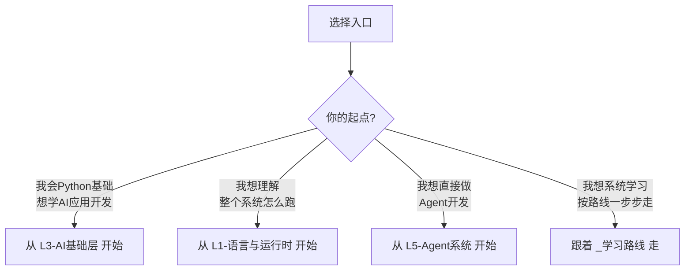

·
# VibeCut 知识图谱

> 从大二学生到 AI 应用开发者 — 以 VibeCut 为载体的系统学习路径

## 这是什么

这份知识图谱以 **VibeCut（AI 影视解说/口播导演台）** 为项目载体，把从语言基础到 AI Agent 架构的全部技术栈组织成一个可学习的知识网络。

每个笔记是一个独立的知识点，包含：
- **是什么** — 概念定义
- **为什么需要** — 在 VibeCut 中解决什么问题
- **前置知识** — 需要先理解什么
- **关键概念** — 核心知识点
- **在 VibeCut 中的应用** — 代码位置和实际用法
- **进一步学习** — 延伸阅读

## 如何使用

## 知识层级一览

| 层级             | 主题                           | 状态     | 难度    |
| -------------- | ---------------------------- | ------ | ----- |
| [[L1-语言与运行时]]  | Python / JS / Shell / ffmpeg | ✅ 已实现  | 🟢 入门 |
| [[L2-后端基础设施]]  | HTTP服务 / SQLite / SSE流式      | ✅ 已实现  | 🟢 入门 |
| [[L3-AI基础层]]   | Embedding / ASR / LLM / VLM  | ✅ 已实现  | 🟡 核心 |
| [[L4-RAG体系]]   | 语义索引 / 向量检索 / 混合搜索           | ✅ 已实现  | 🟡 核心 |
| [[L5-Agent系统]] | LangGraph / 工具定义 / 人机协作      | 🔄 规划中 | 🔴 进阶 |
| [[L6-前端工程]]    | React / Vite / 视频编辑引擎        | ✅ 已实现  | 🟡 核心 |
| [[L7-前沿探索]]    | Agentic RAG / 多Agent / 自我学习  | 📅 远期  | 🔴 前沿 |

## 标签索引

按主题维度浏览：

- `#language` — Python, JavaScript, Shell
- `#ai-model` — BGE, Whisper, DeepSeek, MiMo
- `#framework` — LangChain, LangGraph, React, Vite
- `#technique` — RAG, Embedding, SSE, Agent
- `#infrastructure` — SQLite, HTTP, ffmpeg
- `#concept` — 方法论、设计哲学、架构原则
- `#implemented` — 已实现 | `#planned` — 规划中 | `#frontier` — 前沿探索

## 快速导航

- 🗺️ **学习路线**: [[_学习路线]] — 从入门到精通的推荐路径
- 📋 **技术清单**: VibeCut 完整技术栈（见 [[L1-语言与运行时]] 等各层 MOC）
- 🏗️ **架构文档**: `docs/tech/` — 架构方案、框架选型、演化分析
- 💻 **源码**: `vibecut-server/` + `vibecut-web/`
